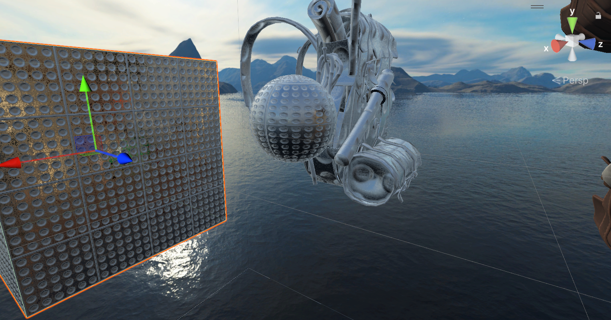
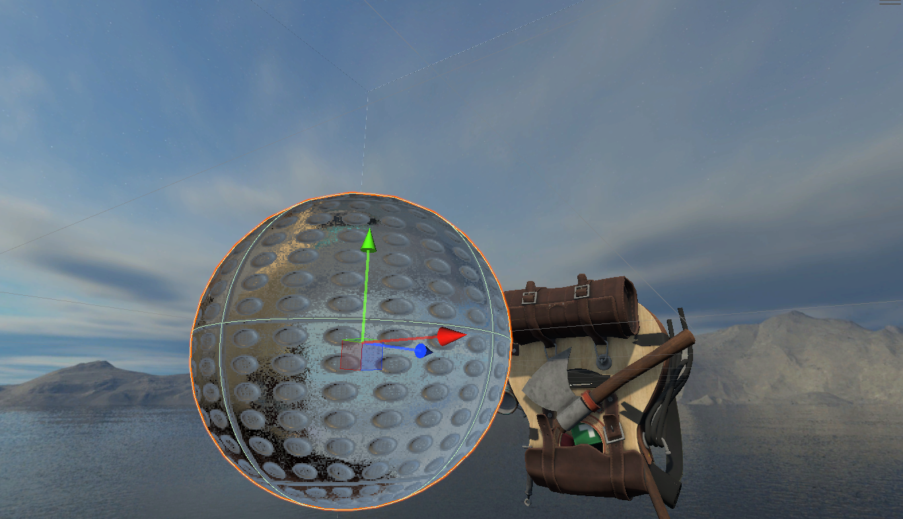
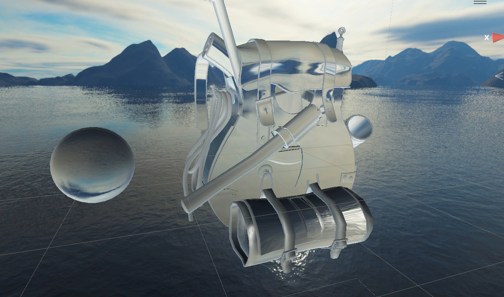
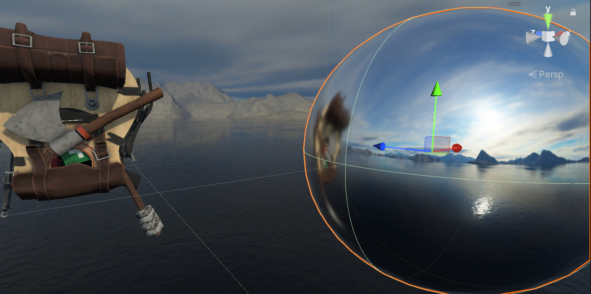

# MyUnityPortfolio

Unity Shader学习过程中留下的一点作品

### 1. 溶解燃烧效果

​	噪声贴图配合clip()实现的溶解效果，加上色调贴图设置溶解边缘颜色，模仿燃烧效果。

---

### 2. 表面凹凸的透明玻璃/镜面材质

1.  立方体贴图+反射探针实现环境反射
 	2.  法线贴图实现表面凹凸
 	3.  使用反射探针生成的立方体贴图实现反射效果

带法线贴图的镜面反射

带法线贴图的类玻璃

光滑玻璃

光滑镜面