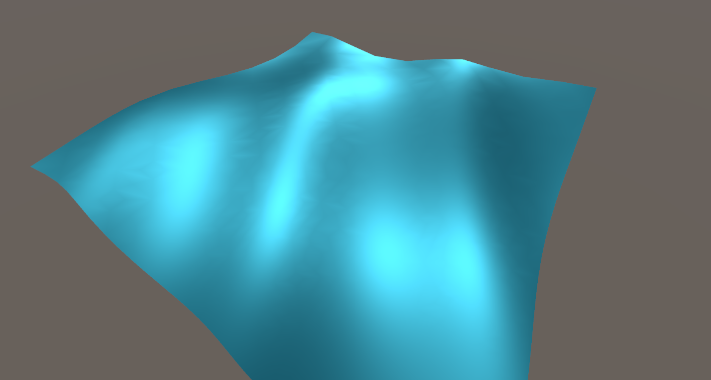
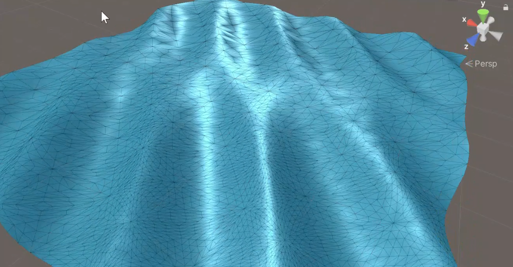
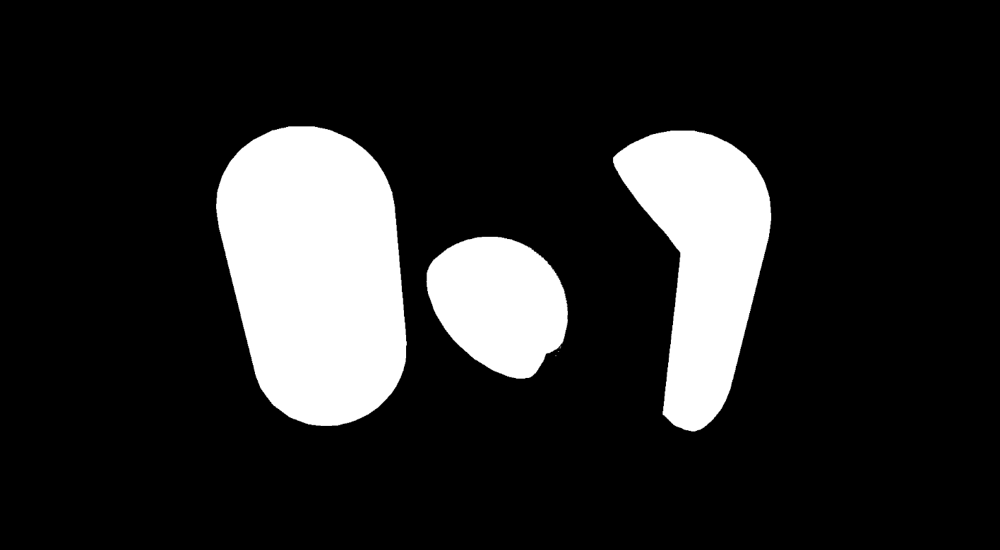
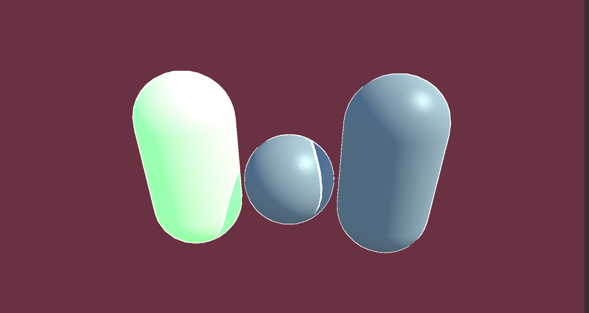
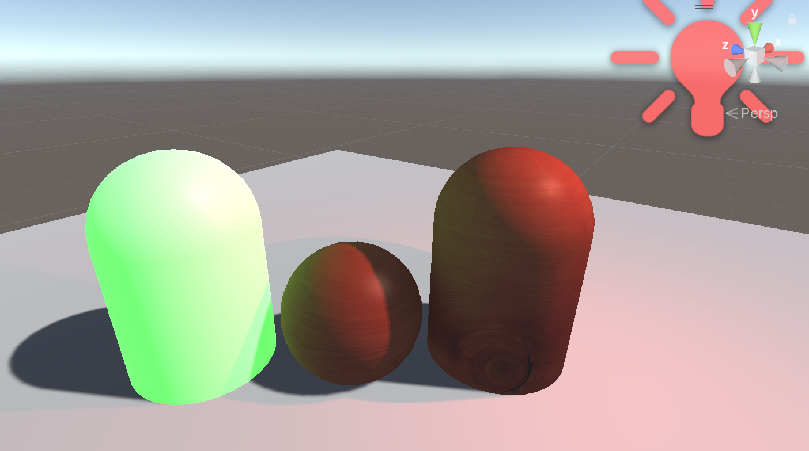

# MyUnityPortfolio

Unity Shader学习过程中留下的一点作品

### 1. 溶解燃烧效果

​	噪声贴图配合clip()实现的溶解效果，加上色调贴图设置溶解边缘颜色，模仿燃烧效果。

---

### 2. 表面凹凸的透明玻璃/镜面材质

1.  立方体贴图+反射探针实现环境反射
 	2.  法线贴图实现表面凹凸
 	3.  使用反射探针生成的立方体贴图实现反射效果

带法线贴图的镜面反射

带法线贴图的类玻璃

光滑玻璃

光滑镜面

### 3. 波浪效果

利用曲面细分着色器实现的波浪效果

使用技术：

1. 曲面细分着色器

   曲面细分着色器可编写的部分为Hull Shader与Domain Shader，在Hull Shader中指定每边细分数/内部细分数等细分属性，经过Tessellator处理，在Domain Shader中得到所有细分顶点的重心坐标与控制点坐标。

2. Gerstner波

   模拟水浪的函数，在正弦波的基础上加上水平方向的偏移，可将多个方向波的采样叠加

3. 基于视距的曲面细分

   在Hull Shader中，根据视距决定不同patch的细分系数

4. 法线由微分法计算得出

### 4.后处理

通过脚本调用OnRenderImage()方法，以指定材质对屏幕像素进行处理。

1. 二值化

2. 通过卷积实现的描边

### 5.光照

右侧两为Lighting Shader，左一使用Standard Shader。其中漫反射，镜面反射光的基础量为Blinn-Phong模型计算得出。包含阴影接收，阴影投射，烘焙间接光，球谐环境光，自发光造成的间接光影响等特性。整个Shader离PBR渲染方式还有不少距离，但也算是基本包括了光照条件下需要的大部分内容。//TODO：完成PBR渲染的Shader

1. 直接光照漫反射项（diffuse）受金属度（metallic）影响，若开启lightmap，受lightmap采样结果影响
2. 直接光照镜面反射（specular）受光滑度（smoothness）影响。

3. 环境光照（ambient）取自环境光的球谐结果
4. 接收阴影的实现：静态物体的阴影通过烘焙贴图lightmap采样获得，动态物体通过shadowmap获得
5. 投射阴影：即Shadowcaster Pass
6. 别忘了Meta Pass

